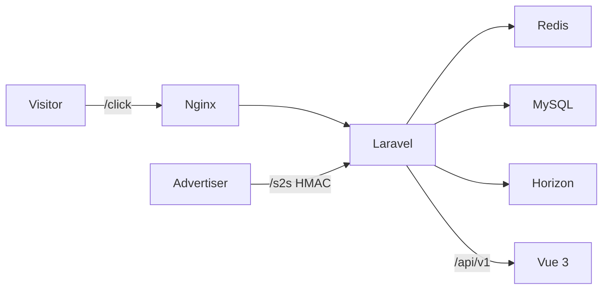

## CPA Network Platform (Laravel 11 + Vue 3)

Run locally

- Prereqs: Docker + docker-compose or local PHP 8.3 + Composer + Node 20

Make commands

- make init: copy envs, build images, install deps, migrate and seed
- make up: start containers
- make test: run tests
- make horizon: start Horizon

Services

- App: http://localhost:8080
- Frontend: http://localhost:5173
- Mailpit: http://localhost:8025
- MySQL: localhost:33060 (cpa/cpa)
- Redis: localhost:63790

Architecture



HTTP Examples (.http)

```http
GET http://localhost:8080/api/click?offer_id=1&aff_id=1001&sub1=test&tid=abc123

###
GET http://localhost:8080/api/s2s?txid=01HZPXT0ABC&status=approved&revenue=1.50&payout=1.00&currency=USD&external_txid=ADV-999&sig=HMAC_HERE
```
